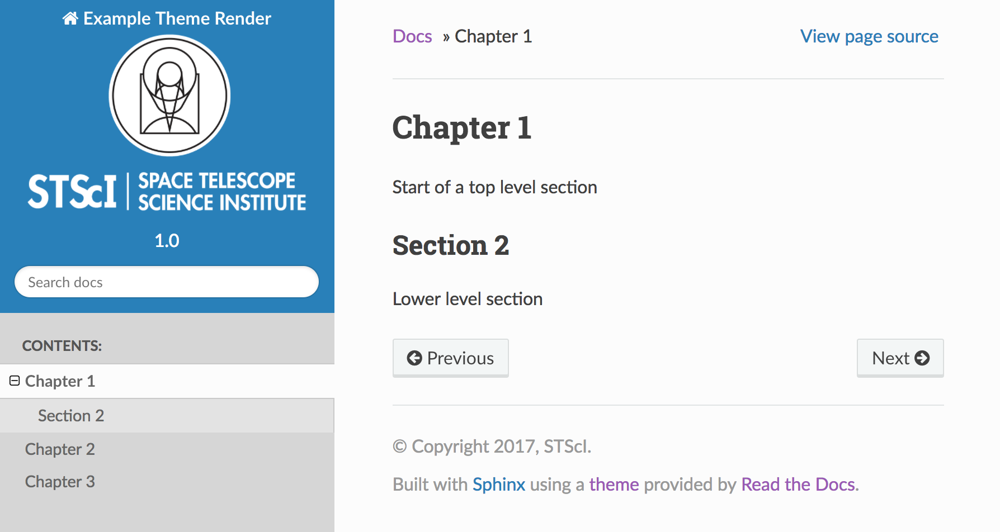

# stsci_rtd_theme
STScI branded sphinx theme that inherits from sphinx_rtd_theme

This theme is based off of the sphinx_rtd_theme, from which it inherits, but the CSS styling
has been altered for easier reading on a variety of platforms and browsers.

## Installation
You can apply this theme to your current documents by installing this repository like any other python package:

Either from GIT:
```
git clone https://github.com/spacetelescope/stsci_rtd_theme.git
python setup.py install
```
Or with PIP:
```
# install directly from the git repository
pip install -e https://github.com/spacetelescope/stsci_rtd_theme.git

# install from pypi release
pip install stsci_rtd_theme
```
## Adding to your Sphinx docs
If you haven't already created your Sphinx documentation, you can start sphinx with
`sphinx-quickstart` and follow the guided steps. When you are finished,
add these lines to your `conf.py` file:
```
import stsci_rtd_theme
html_theme = 'stsci_rtd_theme'
html_theme_path = [stsci_rtd_theme.get_html_theme_path()]
```


## Making this theme work on Readthedocs
Add the following lines to your documentations conf.py file:
```
import sphinx
import stsci_rtd_theme

def setup(app):
    app.add_stylesheet("stsci.css")
    
# the below is not strictly necessary but helps with extensions you may use across versions
from distutils.version import LooseVersion

on_rtd = os.environ.get('READTHEDOCS', None) == 'True'
if on_rtd:
    extensions.append('sphinx.ext.mathjax')
elif LooseVersion(sphinx.__version__) < LooseVersion('1.4'):
    extensions.append('sphinx.ext.pngmath')
else:
    extensions.append('sphinx.ext.imgmath')    
```
Finally, when setting up your documentation build on readthedocs, make sure to include a requirements file which installs this theme
